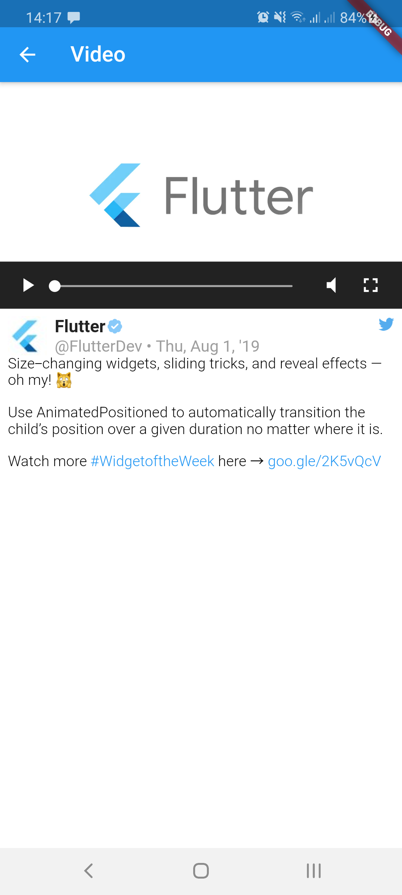
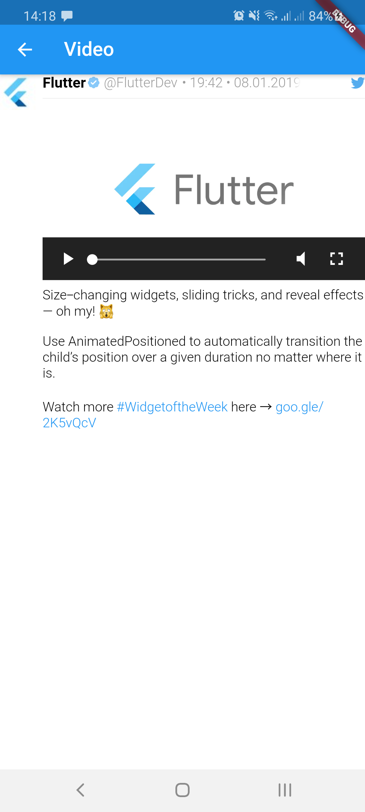

# tweet_ui

Flutter Tweet UI - Flutter package that is inspired from [twitter-kit-android](https://github.com/twitter-archive/twitter-kit-android). 

Works on iOS and Android.

Note: Sample tweets may be different from original tweets, so don't be surprised when you click and it will differ from the one at twitter.com.

## Getting Started

To use this package add it to the pubspec.yaml file:

`tweet_ui: <latest_version>`

import it:
 
`import 'package:tweet_ui/tweet_ui.dart';`

and create a `TweetView` from a JSON:

```
TweetView.fromTweet(
    Tweet.fromRawJson(
        jsonFromTwitterAPI
        // {"created_at": "Mon Nov 12 13:00:38 +0000 2018", "id": 1061967001177018368, ...
    )
);
```

If you want to show tweets with videos, please check the [video_player installation](https://pub.dev/packages/video_player#installation).

## Example of supported view and media types:

| Variant  | Standard tweet                                                           | Compact tweet                                                           | Standard Quote tweet                                                           | Compact Quote tweet                                                           |
|:--------:|:-------------------------------------------------------------------------|:------------------------------------------------------------------------|:-------------------------------------------------------------------------------|:------------------------------------------------------------------------------|
| 1 photo  |   |   |   |   |
| 2 photos |  |  |  |  |
| 3 photos |  |  |  |  |
| 4 photos |  |  |  |  |
|  video   |     |     |     |     |
|   GIF    |       |       |       |       |

## Styling Tweets

By default the `chewie`/`video_player` package is used to show a gif/video, but you can set the `useVideoPlayer` flag to `false` if you want to show a image placeholder provided by the Twitter API and open a video in a new page.

|    Variant    | With video_player/chewie                                                               | With placeholder                                                         |
|:-------------:|:-----------------------------------------------------------------------------|:----------------------------------------------------------------------------|
| Standard Video |  |  |
| Compact Video |  |  |
| Standard GIF |  |  |
| Compact GIF |  |  |


All texts are customizable. You can copy from the `defaultxxx`, `defaultCompactxxx` and `defaultQuotexxx`styles like in the example below.

```
Card(
    color: Colors.grey,
    child: Padding(
      padding: const EdgeInsets.all(8.0),
      child: CompactTweetView.fromTweet(
        Tweet.fromRawJson(
          snapshot.data,
        ),
        useVideoPlayer: false,
        userNameStyle: defaultUserNameStyle.copyWith(fontWeight: FontWeight.w200),
        userScreenNameStyle: defaultUserScreenNameStyle.copyWith(fontWeight: FontWeight.w600),
        textStyle: defaultTextStyle.copyWith(
          fontWeight: FontWeight.w200,
          fontStyle: FontStyle.italic,
          shadows: [Shadow(color: Colors.white30)],
        ),
        clickableTextStyle: defaultClickableTextStyle.copyWith(color: Colors.white),
        backgroundColor: Colors.grey,
        quoteUserNameStyle: defaultQuoteUserNameStyle.copyWith(fontWeight: FontWeight.w800),
        quoteUserScreenNameStyle: defaultQuoteUserScreenNameStyle.copyWith(fontWeight: FontWeight.w100),
        quoteTextStyle: defaultQuoteTextStyle.copyWith(fontStyle: FontStyle.italic),
        quoteClickableTextStyle: defaultQuoteClickableTextStyle.copyWith(color: Colors.cyanAccent),
        quoteBorderColor: Colors.blueAccent,
        quoteBackgroundColor: Colors.blueGrey,
      ),
    ),
  );
```

|    Variant    | Standard tweet                                                               | Compact tweet                                                               |
|:-------------:|:-----------------------------------------------------------------------------|:----------------------------------------------------------------------------|
| Custom styles |  |  |


## TODO

1. Get Tweets from Twitter API
2. Write tests
3. Add option to set image quality