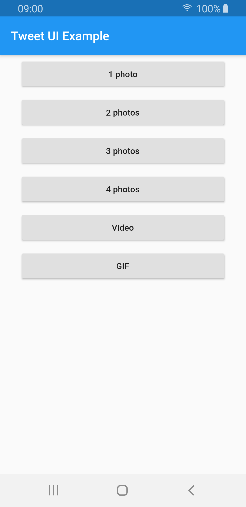
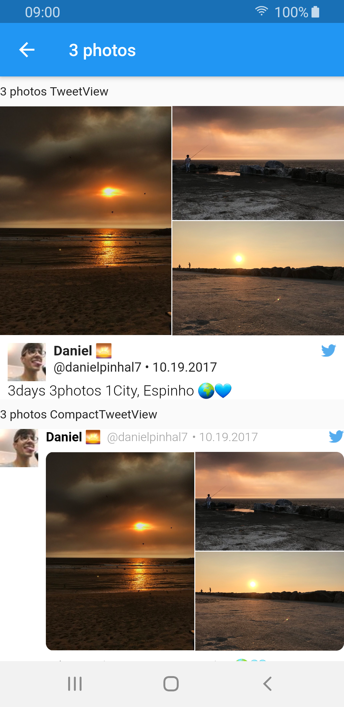
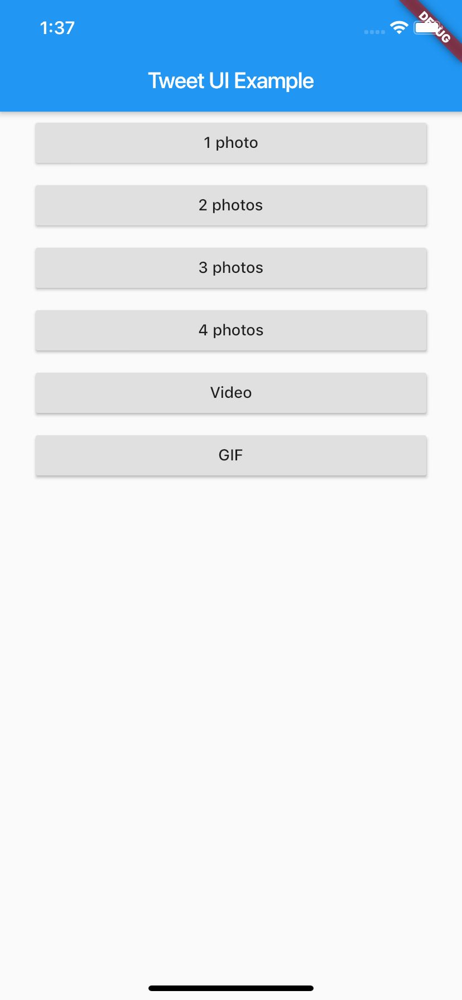
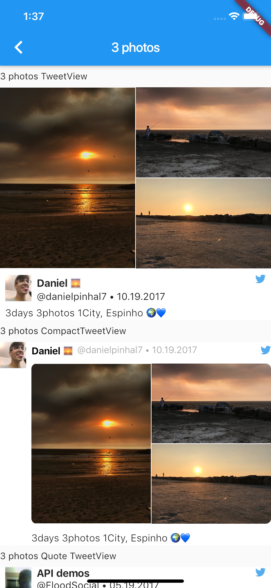

### Example Flutter Tweet UI app

| Platform | Standard tweet                                                      | Compact tweet                                                           |
|:--------:|:--------------------------------------------------------------------|:------------------------------------------------------------------------|
| Android  |  |  |
|   iOS    |      |      |

> Video/GIF Tweets don't work on iOS simulators ([video_player ios instructions](https://pub.dev/packages/video_player#ios))